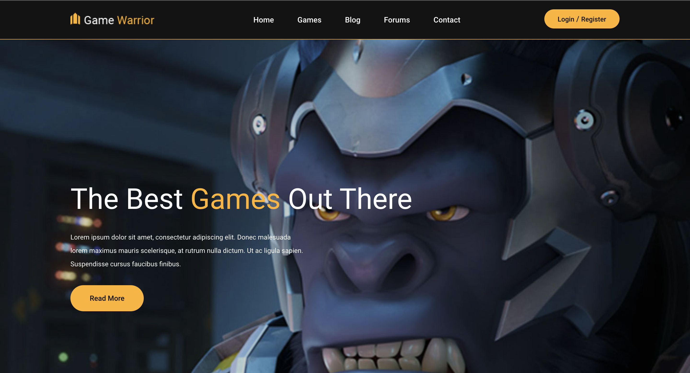

# Django-game-website
Thematic site dedicated to computer games

**Описание:**

Динамичный игровой портал, посвященный миру компьютерных игр. На этом сайте вы найдете последние новости, обзоры игр, гайды и полезные советы.

**Функционал:**

* **Новости:** Актуальные новости из мира игр.
* **Обзоры:** Детальные обзоры игр разных жанров.
* **Форум:** Место для обсуждения игр, общения с другими геймерами.
* **База данных игр:** Каталог игр с подробной информацией.
* **Персонализация:** Возможность создания профиля и подписки на любимые игры.

**Технологии:**

* **Backend:** Django, Python, PostgreSQL
* **Frontend:** Bootstrap, CSS, HTML

**Установка:**

1. Клонировать репозиторий: `git clone https://github.com/Tixon-noxit/Django-game-website.git`
2. Создать виртуальное окружение и установить зависимости: `pip install -r requirements.txt`
3. Запустить миграции базы данных: `python manage.py migrate`
4. Запустить сервер разработки: `python manage.py runserver`

**Лицензия:**

Этот проект распространяется под лицензией Apache License Version 2.0.

**Контакты:**

* **Автор:** Тихон Чабусов
* **Email:** chabysow@gmail.com
* **GitHub:** https://github.com/Tixon-noxit
